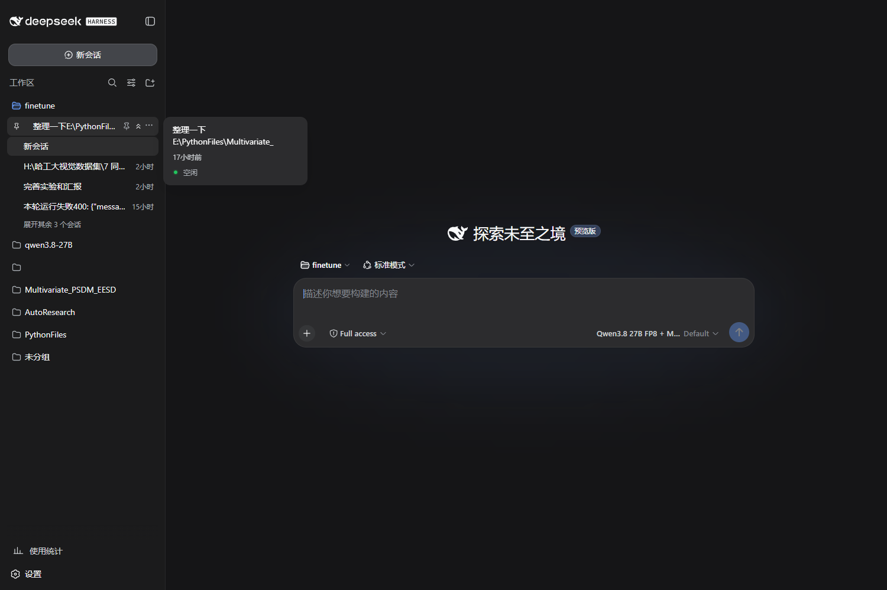
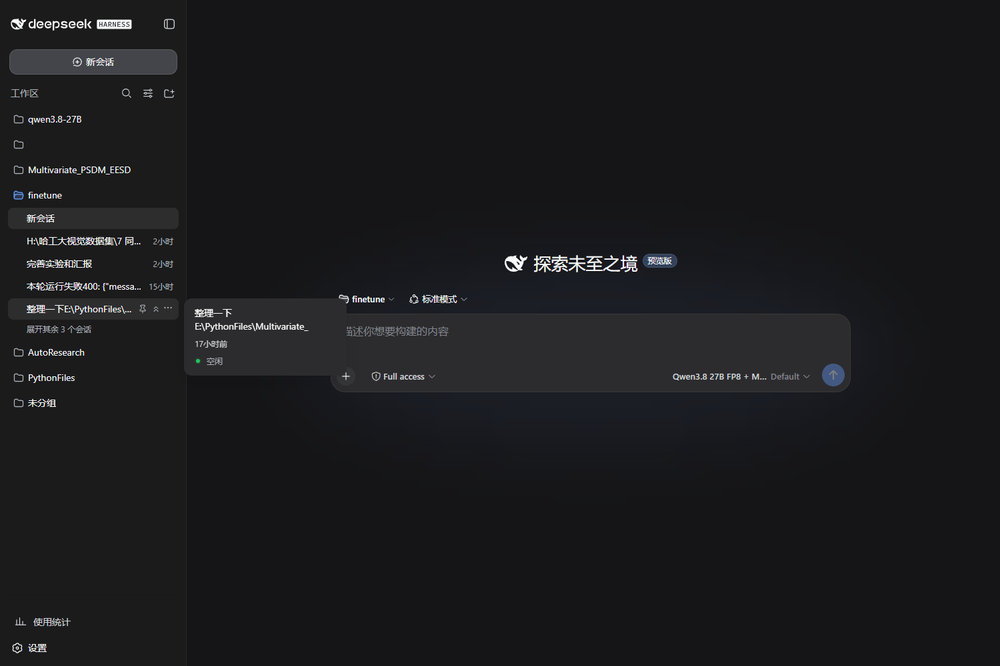

[English](README.en.md)

# dsh-pin

[](https://github.com/Yu-tao-Li/dsh-pin/actions/workflows/ci.yml)
[](LICENSE)
[](https://github.com/Yu-tao-Li/dsh-pin)

**给 [DeepSeek Harness](https://github.com/deepseek-ai/deepseek-harness) 的侧边栏会话加上「置顶」**——悬停任意会话,两个按钮:📌 置顶到本工作区、⌃⌃ 置顶到列表最上面(连它的工作区一起提到最前);再点一次取消置顶,**精确还原**原来的位置。

| ① 置顶到列表最上面:会话所在工作区提到列表首位,会话排到组内第一,标题旁出现蓝色 📌 标记 | ② 悬停会话行:📌 工作区内置顶 / ⌃⌃ 最上面置顶,随时可点 |
|---|---|
|  |  |

## 特性

- **两级置顶**——📌 把会话置顶到**本工作区**内;⌃⌃ 把会话**置顶到整个列表最上面**(其工作区组同时移到列表首位)。工作区组头部也有 ⌃⌃ 按钮,可单独把整个工作区置顶。
- **精确还原**——取消置顶时按记录的位置锚点(`before`/`after` 双锚点)把会话放回原处:宿主持久顺序与浏览器显示顺序**双双还原**;锚点失效时逐级回退(追到末尾),绝不丢位置。
- **沿用宿主官方顺序 API**——`workspace.insertSessionBefore` / `workspace.insertBefore`,与应用自带拖拽排序同一条通道;顺序持久化在 DSH 工作区注册表里,所有浏览器/客户端可见。**不改 DSH 本体,零运行时依赖**。
- **跟随应用的排序语义**——应用默认「最近更新」排序(按活跃度,且该模式下应用自己禁用拖拽)。dsh-pin 置顶时会自动切到「手动排序」让置顶可见;置顶状态(📌 标记、按钮高亮)实时同步。
- **诚实的边界**——「未分组」会话与平铺列表(“In one list”)按应用设计没有手动顺序,按钮自动隐藏;RPC 失败有红色反馈;存储损坏自动降级为空。

## 安装

```powershell
# 从 GitHub(--profile 指定装进哪个 profile)
dsh plugin --profile web add github:Yu-tao-Li/dsh-pin
# 或在 DSH 设置的插件市场(dshmarket)搜索 dsh-pin
```

重启 `dsh web` 生效。按钮出现在侧边栏会话行的悬停菜单里(⋯ 左侧)。

> 纯客户端插件:服务端半个是 no-op,所有排序走宿主现成的 RPC;不新增任何 HTTP 路由,无端口、无后端。

## 工作原理

```
侧边栏会话行(React)
   │  悬停 → 注入 📌 / ⌃⌃ 按钮(DOM,不侵入 React 树;MutationObserver 自愈)
   ▼
dsh-pin 客户端 bundle(本仓库 lib/client.js)
   ├─ React fiber 读取行身份(session id / workspace id)
   ├─ 读取应用视图存储(localStorage "dsh.workspace.view.v5"):当前排序模式 + 显示顺序
   ├─ pin-core(纯函数,18 个单测覆盖):计划 pin / unpin / move-end,计算双锚点
   └─ 执行
        ├─ 宿主 RPC  workspace.insertSessionBefore / insertBefore   ← 持久顺序
        ├─ 应用存储   setSessionOrder / setOrderBy(必要时切手动排序)  ← 显示顺序
        └─ 本地记录   localStorage "dsh-pin.records.v3"(取消置顶的还原锚点)
```

- **记录**存在浏览器 localStorage(每个浏览器各自记住“是谁帮我置顶的”);**顺序**存在宿主工作区注册表(全局生效)。
- 置顶判定 = 记录存在 ∧ 会话确实在目标位置(被手动拖走后按钮自动恢复为“可置顶”态)。

## 安全与限制

- 只写两类状态:宿主工作区/会话**顺序**(官方 API,可随时手动拖回)与浏览器本地记录;不碰会话内容、不碰凭据、不新增网络端点。
- 仅 Web GUI 可用(TUI/Headless 没有侧边栏);「未分组」桶与平铺模式不支持(应用设计)。
- 还原依赖原相邻会话仍存在;相邻会话被归档/删除时按回退规则放置(末尾或前一邻居处),不会静默丢失。
- 依赖应用内部结构(React fiber 行身份、视图存储键名 `dsh.workspace.view.v5`):DSH 大版本升级后若结构变化,按钮可能失效——此时升级/等待本仓库适配即可,不影响应用本身。

## 开发

```
lib/pin-core.mjs        纯逻辑核心(Node 可测;构建时内联进 bundle)
lib/client.js           客户端 bundle(已构建,勿手改;由 build 生成)
src/client-src.js       客户端源码(/*__PIN_CORE__*/ 占位符)
scripts/build-client.mjs  构建(含语法校验)+ --check(校验已提交 bundle 同步)
test/pin-core.test.mjs  18 个单测(node:test,零依赖)
e2e/browser-e2e.mjs     无头 CDP 端到端(需要一台跑着 dsh web 的实例)
e2e/screenshot.mjs      README 截图脚本
```

```powershell
npm test            # 单测
npm run build       # 重新生成 lib/client.js
npm run check       # 校验 bundle 与源码同步(CI 用)
npm run e2e         # 对 http://127.0.0.1:3081 的 scratch 实例做端到端
```

CI(`.github/workflows/ci.yml`)在每次 push/PR 时跑单测 + bundle 同步校验。E2E 需要 Windows + 运行中的 DSH 实例,不进 CI(手动跑)。

## 许可

MIT,见 [LICENSE](LICENSE)。
